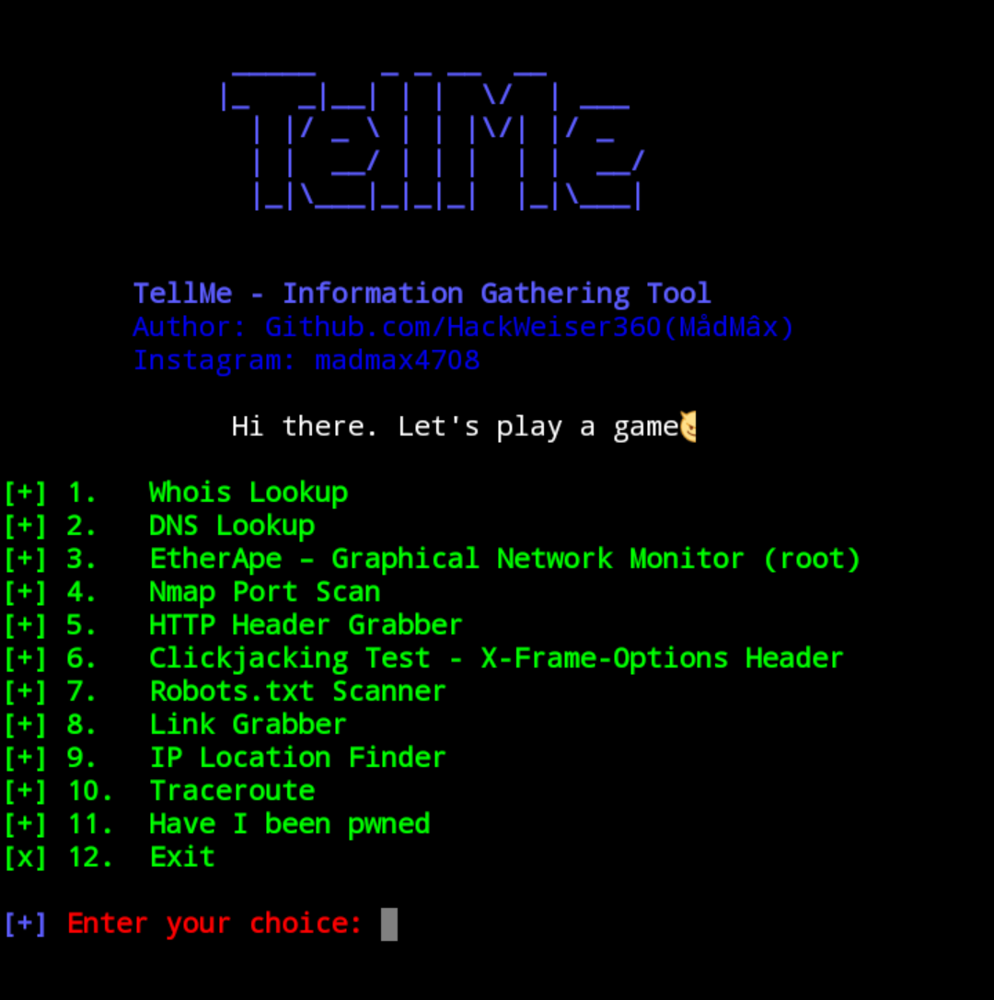

# TellMe

TellMe is an Information Gathering tool made in python 3. It tells you all you want to know about your target

To run TellMe, you only need  a domain or ip.
TellMe can work with any Linux distros if they support python 3.

## TellMe gathers information such as:

1.   Whois Lookup
2.   DNS Lookup
3.   EtherApe
4.   Nmap Port Scan
5.   HTTP Header Grabber
6.   Clickjacking Test
7.   Robots.txt Scanner
8.   Link Grabber
9.   IP Location Finder
10.  Traceroute
11.  Have I been pwned
12.  Exit

## Install and run on Linux
You have to install Python 3 first:

  
* Install Python 3 on Arch Linux and its distros: sudo pacman -S python3
* Install Python 3 on Debian and its distros: sudo apt install python3

 
 
You have to install Nmap and EtherApe too:

  
* On Arch Linux and its distros: sudo pacman -S nmap etherape

  
* On Debian and its distros: sudo apt install nmap etherape

After installing EtherApe sometimes a GNOME error can occur, for which you install: (This will solve the common error)
* apt install libgnomeui-0: amd64

    
    
## Installation and Usage
* $ git clone https://github.com/HackWeiser360/TellMe
* $ cd TellMe
* $ pip3 install -r requirements.txt
* $ python3 TellMe.py

## Follow me👇

<a href="https://www.instagram.com/madmax4708/" target="_blank">

### Stargazers

